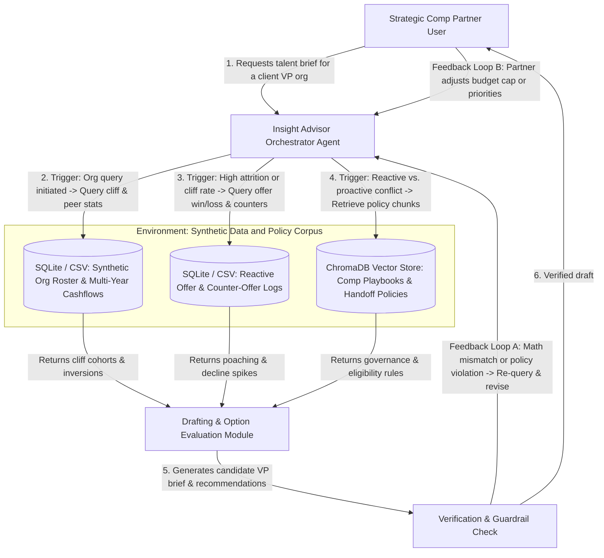

# Checkpoint 1.1: Problem Framing and Initial Agent Design

## System Architecture Diagram

## Written Submission, 645 Words

### 1. The agent, the problem, and the intended user

The **Strategic Talent and Compensation Insight Advisor** is a Research Assistant agent built for an enterprise **Strategic Compensation Partner** who advises Engineering Vice Presidents and Lead People Partners. Today, compensation teams often operate in two disconnected silos. A transactional Offers and Counter-Offers team handles external hiring and reactive retention when employees receive competing offers, while Strategic Compensation Partners manage proactive retention budgets, annual equity cycles, and organizational health. 

Before a monthly talent review with a VP, the Compensation Partner must manually stitch together spreadsheets of internal employee compensation, multi-year equity vesting schedules, recent offer decline logs, and evolving policy documents. Because this manual synthesis takes hours of spreadsheet work, partners struggle to spot early links between external hiring friction and internal retention risk, and executives receive dense tables rather than clear, actionable insights. The agent solves this by investigating structured workforce data alongside policy documentation to produce a concise, verified executive decision brief.

### 2. Why a standalone LLM or simple prompting is insufficient

A standalone LLM fails at this task for four reasons:
- **Context window degradation and data scale.** Dumping thousands of employee roster rows, multi-year vesting schedules, and dozens of policy documents into a single prompt exceeds smaller model context windows and degrades reasoning accuracy in larger models.
- **Exact arithmetic vs. probabilistic text.** Compensation analysis requires exact aggregations, percentile rankings, year-over-year cashflow drop calculations, and budget caps that LLMs hallucinate without deterministic data tools.
- **Multi-step conditional investigation.** Investigating a talent hotspot requires iterative hypothesis testing. The system must first detect where internal equity cliffs exist, then check whether that same job family is experiencing declining new-hire offer acceptance rates or rising counter-offers, and finally retrieve the specific governance policy that governs whether to intervene through offer bands or proactive retention grants.
- **Verification before executive delivery.** Outputs shared with VPs require automated validation against source numbers and policy constraints before a human partner reviews them.

### 3. The environment: documents, data sources, tools, and users

The agent operates within a local Python environment using a Gradio interface and a modular model router supporting OpenRouter cloud models and local Ollama models. It interacts with strictly synthetic data representing a 2,000-person technology organization:
- **Structured data sources.** Three relational tables stored in SQLite and CSV format: an *Org Roster & Cashflow Table* containing synthetic salaries, peer percentiles, performance ratings, and four-year vesting schedules; a *Reactive Offers & Counters Log* tracking candidate offer acceptances, declines, competing employers, and counter-offer outcomes; and a *Department Budget Ledger*.
- **Unstructured knowledge base.** A ChromaDB vector store indexing synthetic compensation policy PDFs, guidelines defining the boundary between reactive counter-offers and proactive retention, and historical executive briefing templates.
- **Tools and users.** Deterministic Python/Pandas query tools for statistical aggregation, a semantic search tool over ChromaDB, a markdown report generator, and the Compensation Partner user who steers the investigation.

### 4. The actions the agent needs to take and their triggers

Each action is bound to a specific trigger:
1. **Scan and aggregate org health metrics.** *Triggered when the user selects a VP organization and requests a talent review.* The agent calls the roster analysis tool to identify cohorts with projected year-over-year cashflow drops exceeding 15 percent or peer positioning below the 25th percentile.
2. **Cross-examine reactive market signals.** *Triggered automatically when Action 1 flags an at-risk job family or location.* The agent queries the Offers and Counters Log to measure whether offer acceptance rates have dropped or counter-offer volume has spiked in that same segment.
3. **Retrieve governance and handoff rules.** *Triggered when both reactive market pressure and internal retention risk appear in the same cohort.* The agent queries ChromaDB for policy rules governing whether the issue should be addressed by the Offers team adjusting hiring bands or the Client Partner deploying proactive retention equity.
4. **Draft the executive insight brief.** *Triggered once data aggregation and policy retrieval complete.* The agent synthesizes a one-page brief summarizing the risk, comparing intervention options against available budget, and citing exact source metrics.

### 5. How feedback guides behavior across steps

The system relies on three feedback loops to adapt its behavior:
- **Tool execution and schema feedback.** If a SQLite or Pandas query returns an empty cohort, a syntax error, or a sample size too small for statistical relevance, the error signal prompts the agent to broaden its filter criteria, such as expanding from a single sub-team to the broader job family, before proceeding.
- **Self-verification and policy audit loop.** Before displaying the brief, a verification step compares every dollar figure and headcount number in the drafted text against the raw tool outputs and checks that proposed retention spend does not exceed the remaining budget in the ledger. Any discrepancy triggers a targeted regeneration of the flawed section.
- **Human-in-the-loop partner refinement.** When the Compensation Partner reviews the brief in the UI and adjusts a constraint, such as lowering the budget cap or excluding employees promoted within the last six months, the agent captures that feedback, updates its session memory, re-runs the affected tool calculations, and revises the trade-off recommendations.
