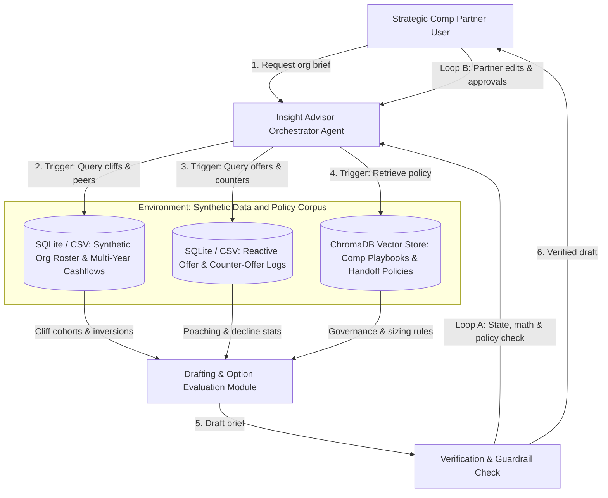

# Checkpoint 1.1: Problem Framing and Initial Agent Design

## System Architecture Diagram

## Written Submission

### 1. The agent, the problem, and the intended user

The **Strategic Talent and Compensation Insight Advisor** is a Research Assistant agent for a **Strategic Compensation Partner** who advises Engineering Vice Presidents and Lead People Partners. Compensation work sits in two silos. An Offers and Counter-Offers team handles external hiring and reactive retention when employees receive competing offers. Strategic Compensation Partners manage proactive retention budgets, annual equity cycles, and organizational health.

Before a monthly VP talent review, the partner stitches together spreadsheets of employee compensation, vesting schedules, offer decline logs, and policy documents. The work takes hours. Early links between external hiring friction and internal retention risk go unnoticed, and executives get dense tables instead of a recommendation. The agent reads the data and the policies together and produces a short, verified decision brief.

### 2. Why a standalone LLM or simple prompting is insufficient

A standalone LLM fails at this task for four reasons:
- **Data scale.** Thousands of roster rows, vesting schedules, and policy documents overflow a small model's context window and degrade reasoning in larger ones.
- **Exact arithmetic.** Percentile ranks, cashflow drops, and budget caps must be exact. Next-token prediction can return a plausible total that is wrong.
- **Dynamic, multi-step investigation.** Finding a talent hotspot means testing hypotheses in order and choosing each next dataset or tool from intermediate results. The agent checks offer trends only for job families with equity cliffs, and retrieves policy only when both signals appear. A single prompt cannot sequence these checks, and a fixed pipeline wastes queries on healthy segments.
- **Verification before delivery.** A verifier must check every number in a VP brief against the source data and policy limits.

### 3. The environment: documents, data sources, tools, and users

The agent runs locally in Python behind a Gradio interface. A two-tier model router sends routine tool calls to an 8B to 12B model and sends action selection and trade-off synthesis to a stronger reasoning model. Small models call tools reliably once the tools do the math and retrieval. All data is synthetic and describes a 2,000-person technology company:
- **Structured data.** Three SQLite tables: an *Org Roster & Cashflow Table* with salaries, peer percentiles, ratings, and vesting schedules; a *Reactive Offers & Counters Log* with offer outcomes, competing employers, and counter-offers; and a *Department Budget Ledger*.
- **Policy documents.** A ChromaDB vector store of compensation policies, including the rules that separate reactive counter-offers from proactive retention.
- **Tools and users.** Read-only Python/Pandas query tools that return compact Markdown table summaries instead of raw rows, a semantic search tool over ChromaDB, a report generator, and the Compensation Partner.

### 4. The actions the agent needs to take and their triggers

The current state decides which action runs next:
1. **Scan org health.** *Triggered when the user requests a talent review for a VP organization.* The roster tool flags cohorts with a projected cashflow drop above 15 percent or peer positioning below the 25th percentile.
2. **Cross-examine market signals.** *Triggered when Action 1 flags an at-risk job family or location.* The agent checks the Offers and Counters Log for falling offer acceptance or rising counter-offers in that segment.
3. **Retrieve governance rules.** *Triggered when both signals hit the same cohort.* The agent searches ChromaDB for the policy that decides whether the Offers team adjusts hiring bands or the partner grants retention equity.
4. **Draft the brief.** *Triggered once aggregation and retrieval finish.* The agent writes a one-page brief that states the risk, compares options against the remaining budget, and cites source metrics.
5. **Ask for approval.** *Triggered when an option needs a policy exception, such as a top-tier retention grant.* The agent waits for the partner to accept or decline it.

### 5. How feedback guides behavior across steps

Three feedback loops shape the next step:
- **Tool results.** An empty cohort, a query error, or a sample too small to trust makes the agent widen its filter, say from one sub-team to the whole job family, or skip queries that no longer apply.
- **Verification.** Before the partner sees the brief, the verifier checks every dollar figure and headcount against the tool outputs and confirms that proposed spend fits the remaining budget. A mismatch regenerates only the flawed section.
- **Partner review.** When the partner changes a constraint, such as a lower budget cap or excluding recent promotions, the agent stores it in session memory, re-runs the affected calculations, and revises the recommendations. A declined exception drops that option from the brief.
